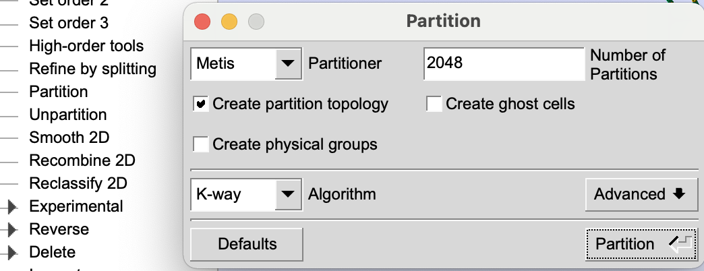
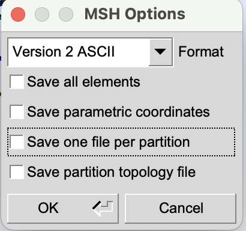
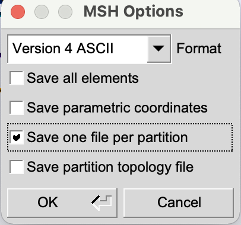

# Generate partitioned mesh for STEPS3/4

 1. partition the mesh in gmsh. 
 

 2. export the mesh
    * for steps3, export the partitioned mesh to .msh file with the following configuration.
 
    
    * for steps4, export the partitioned mesh to .msh file with the following configuration.
 

3. Load the mesh in steps
    * for steps3 with API2, use `part = GmshPartition(mesh)` to fetch the partition info.
    * for steps4, the partition info is fetched automatically when importing the mesh.

